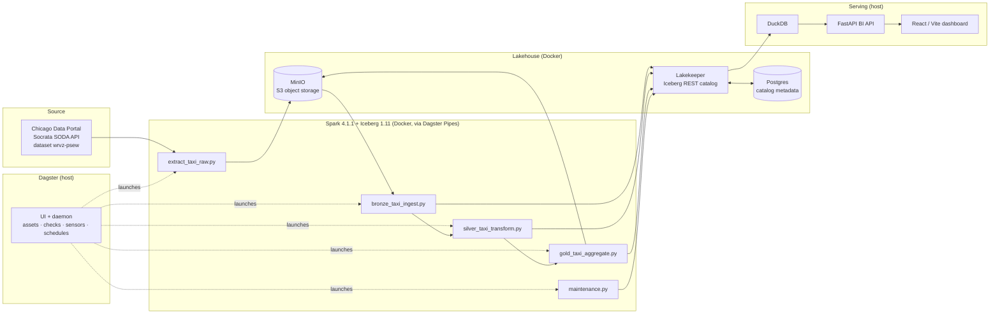

# Chicago Taxi Lakehouse — End-to-End Data Engineering Pipeline

A local, production-shaped **data lakehouse** that ingests the City of Chicago
*Taxi Trips (2013–2023)* dataset, refines it through a **medallion architecture**
(raw → bronze → silver → gold) on **Apache Iceberg**, orchestrates everything with
**Dagster**, and serves interactive analytics through a **DuckDB + FastAPI + React**
BI layer — with **logging, data-quality/volume checks, observability, and alerting**
built in.

Everything runs on a single Windows machine with Docker; nothing is tied to a
specific cloud. Switching from local MinIO to AWS S3 is a **config-only** change.

---

## Table of contents

- [What this project does](#what-this-project-does)
- [Architecture](#architecture)
- [Tech stack (and why)](#tech-stack-and-why)
- [Repository layout](#repository-layout)
- [Prerequisites](#prerequisites)
- [How to run](#how-to-run)
- [Data model](#data-model)
- [Observability, data quality & alerting](#observability-data-quality--alerting)
- [Operational modes](#operational-modes)
- [Configuration reference](#configuration-reference)
- [Requirements coverage](#requirements-coverage)
- [What I'd do with more time](#what-id-do-with-more-time)

---

## What this project does

1. **Extract** — pulls raw taxi trips month-by-month from the Chicago Data Portal
   (Socrata / SODA API) and lands partitioned CSV in object storage
   (`raw/taxi/month=YYYY-MM/`).
2. **Bronze** — loads the raw CSV into a typed, append-friendly Iceberg table,
   partitioned by month.
3. **Silver** — cleans, dedupes (by `trip_id`), and enriches trips with
   analytics-friendly fields (duration, speed, tip %, weekday/hour, airport flag,
   community-area joins).
4. **Gold** — builds business marts (daily KPIs, hour×weekday demand, company
   leaderboard, payment mix, top routes, pickup-area ranking).
5. **Maintenance** — runs Iceberg table upkeep (compaction / snapshot expiry).
6. **Serve** — a DuckDB-backed FastAPI queries the **silver** table on the fly,
   feeding a React/Vite dashboard with fully interactive filters.
7. **Observe** — Dagster provides asset lineage, per-step logs, run timelines,
   data-quality & volume checks, freshness checks, and failure alerts.

---

## Architecture



**Medallion flow**

```
SODA API ──► raw/  (CSV in MinIO)
             │
             ▼
          bronze   typed, month-partitioned Iceberg   (schema on load)
             │
             ▼
          silver   cleaned + deduped + enriched Iceberg (analytics-ready)
             │
             ▼
           gold    business marts (Iceberg)  ──►  DuckDB / FastAPI / dashboard
```

**Key design choices**

- **Iceberg REST catalog (Lakekeeper)** instead of a Hadoop catalog: gives real
  ACID tables, snapshots, and hidden partitioning without wrestling with `winutils`
  on Windows, and it's the same interface a managed cloud catalog would expose.
- **Dagster Pipes launches Spark in Docker**: the orchestrator stays lightweight on
  the host (Windows-friendly), while heavy compute runs in a reproducible Linux
  image on the shared `iceberg_net` network. Jobs stream logs, metadata, and
  data-quality check results back to Dagster over Pipes.
- **Config-only cloud switch**: all endpoints/credentials come from env vars
  (`S3_*`, `ICEBERG_*`). Moving to AWS S3 + a managed catalog needs **no code
  changes** — table identifiers like `lakehouse.gold.trips_daily` stay identical.
- **DuckDB serves silver directly** (not pre-baked gold) for the interactive
  dashboard, so filters are live; gold marts exist for cheaper canned reporting.

---

## Tech stack (and why)

| Layer | Tool | Why this choice |
|---|---|---|
| Ingestion | **Python + Socrata SODA API** | Official, paginated, filterable access to the dataset; token support to avoid throttling. |
| Object storage | **MinIO** (S3-compatible) | Local stand-in for S3; identical API, so cloud migration is config-only. |
| Table format | **Apache Iceberg 1.11** | ACID, schema evolution, hidden month partitioning, snapshots/time-travel, engine-agnostic. |
| Catalog | **Lakekeeper** (Iceberg REST) + **Postgres** | Modern REST catalog (Rust); mirrors managed cloud catalogs; Postgres holds metadata. |
| Compute | **Apache Spark 4.1.1** (PySpark) | Scales the medallion transforms; dynamic partition overwrite makes reloads idempotent. |
| Orchestration | **Dagster 1.13** | Asset-first lineage, partitions/backfills, schedules, sensors, **native observability + asset checks**. |
| Pipes runtime | **Dagster Pipes + Docker** | Runs Spark in a clean container while streaming logs/metadata/checks back to Dagster. |
| Serving (query) | **DuckDB** | Zero-server, reads Iceberg + S3 directly; fast interactive aggregation over silver. |
| Serving (API) | **FastAPI** | Typed, auto-documented (Swagger) BI endpoints with shared filters. |
| Dashboard | **React + Vite + TypeScript** | Lightweight interactive front-end over the API. |
| Config | **.env (single source of truth)** | One place to flip MinIO⇄AWS, dataset window, tokens. |

---

## Repository layout

```
arte_proj/
├─ docker-compose.yml            # MinIO + Lakekeeper + Postgres + one-shot init jobs
├─ .env                          # single config source (git-ignored; holds the SODA token)
├─ docker/
│  ├─ Dockerfile.spark           # Spark 4.1.1 + Iceberg 1.11 + boto3/dagster-pipes image
│  └─ create-default-warehouse.json
├─ spark_jobs/                   # the medallion compute (baked into the Spark image)
│  ├─ extract_taxi_raw.py        # SODA API -> raw CSV in MinIO
│  ├─ bronze_taxi_ingest.py      # raw CSV -> bronze Iceberg (typed)
│  ├─ silver_taxi_transform.py   # bronze -> silver (clean/dedupe/enrich + DQ checks)
│  ├─ gold_taxi_aggregate.py     # silver -> gold marts (+ revenue reconciliation)
│  ├─ maintenance.py             # Iceberg compaction / snapshot expiry
│  └─ common/                    # session (Spark+Iceberg), soda (API client), obs (logging/checks)
├─ orchestration/
│  ├─ arte_dagster/
│  │  ├─ definitions.py          # jobs, schedules, sensors (alarm + freshness), resources
│  │  ├─ alerts.py               # send_alarm() — drop-in for Teams/Slack/email
│  │  └─ assets/                 # raw/bronze/silver/gold/maintenance assets + _common.py
│  ├─ dagster_home/dagster.yaml  # persistent Dagster instance (compute logs, run monitoring, retention)
│  └─ run_dagster.ps1            # launches the Dagster UI + daemon on :3000
├─ serving/
│  ├─ duck.py                    # DuckDB connection wired to Iceberg + MinIO
│  └─ app.py                     # FastAPI BI API (queries silver via DuckDB)
├─ dashboard/                    # React + Vite front-end
└─ data/community_areas.csv      # community-area names + airport flags (dimension; git-ignored)
```

> Note: `data/` and `.env` are git-ignored. `data/community_areas.csv` is required
> at runtime (mounted into the gold job and read by DuckDB) — keep it present locally.

---

## Prerequisites

- **Windows 10/11** with **Docker Desktop** running.
- **Python 3.12** and [**uv**](https://docs.astral.sh/uv/) (host tooling / Dagster / serving).
- **Node.js 18+** (only for the dashboard).
- A free **Chicago Data Portal app token** (recommended, to avoid API throttling).

---

## How to run

All commands are PowerShell, run from the project root unless noted.

### 1. Configure `.env`

Copy the provided `.env` and set your token + ingest window:

```powershell
# in .env
CHICAGO_DATA_PORTAL_TOKEN=<your-socrata-app-token>
TAXI_BACKFILL_START=2023-10-01   # inclusive month
TAXI_BACKFILL_END=2024-01-01     # exclusive month
```

### 2. Build the Spark engine image

```powershell
docker build -f docker/Dockerfile.spark -t arte-spark:4.1.1 .
```

### 3. Bring up the lakehouse infrastructure

```powershell
docker compose up -d
```

This starts MinIO (`:9000` API, `:9001` console), Postgres, and Lakekeeper
(`:8181`), and runs one-shot jobs that create the `lakehouse` bucket, migrate the
catalog DB, bootstrap Lakekeeper, and register the `lakehouse` warehouse.
Console login: `minioadmin` / `minioadmin`.

### 4. Run the pipeline

Dagster runs on the host via `uv`. Set the instance env vars once per shell:

```powershell
cd orchestration
$env:DAGSTER_HOME = "$PWD\dagster_home"
$env:DAGSTER_COMPUTE_LOG_DIR = "$PWD\dagster_home\compute_logs"
```

**Ingest one month** (raw → bronze → silver), per monthly partition:

```powershell
$m = "2023-11-01"
uv run dagster asset materialize --select "raw/taxi_trips"    --partition $m -m arte_dagster.definitions
uv run dagster asset materialize --select "bronze/taxi_trips,silver/taxi_trips" --partition $m -m arte_dagster.definitions
```

**Backfill several months** — loop the partition keys:

```powershell
"2023-10-01","2023-11-01","2023-12-01" | ForEach-Object {
  uv run dagster asset materialize --select "raw/taxi_trips" --partition $_ -m arte_dagster.definitions
  uv run dagster asset materialize --select "bronze/taxi_trips,silver/taxi_trips" --partition $_ -m arte_dagster.definitions
}
```

**Build gold marts + run Iceberg maintenance** (unpartitioned):

```powershell
uv run dagster asset materialize --select "gold/taxi_marts,maintenance/iceberg_optimize" -m arte_dagster.definitions
```

### 5. Launch the observability UI

```powershell
cd orchestration
./run_dagster.ps1        # then open http://localhost:3000
```

You can also drive the whole pipeline from the UI (materialize assets, launch
backfills, watch runs/checks/sensors) instead of the CLI.

### 6. Start the serving layer

```powershell
# API (from serving/)
cd serving
uv run uvicorn app:app --reload --port 8000     # docs at http://localhost:8000/docs

# Dashboard (from dashboard/)
cd dashboard
npm install
npm run dev                                       # http://localhost:5173
```

### 7. Ad-hoc queries (optional)

```powershell
cd serving
uv run python -c "from duck import connect; print(connect().execute('SELECT count(*), round(sum(trip_total),2) FROM lake.silver.taxi_trips').fetchall())"
```

---

## Data model

**Bronze** (`lakehouse.bronze.taxi_trips`) — typed 1:1 load of raw columns,
partitioned by `months(trip_start_timestamp)`.

**Silver** (`lakehouse.silver.taxi_trips`) — cleaned, deduped by `trip_id`, and
enriched with derived fields: `trip_date`, `trip_hour`, `dow_num`, `day_name`,
`duration_min`, `speed_mph`, `tip_pct`, `is_airport`, plus community-area codes.

**Gold marts** (`lakehouse.gold.*`), rebuilt from silver:

| Mart | Grain / content |
|---|---|
| `trips_daily` | day-level KPIs (trips, revenue, avg fare/tip/miles) |
| `trips_by_hour` | hour × weekday demand heatmap |
| `trips_by_company` | operator leaderboard |
| `payment_mix` | payment-type share of trips/revenue |
| `top_routes` | busiest pickup → dropoff pairs (named areas) |
| `trips_by_pickup_area` | pickup community-area ranking (named) |

---

## Observability, data quality & alerting

This is a first-class part of the project, not an afterthought.

**Logging** — every job logs structured, timed steps (`START` / `DONE in Xs` /
`FAILED`) via `spark_jobs/common/obs.py`, streamed to Dagster over Pipes and
persisted by the `LocalComputeLogManager` (see `dagster_home/dagster.yaml`).

**Data-quality & volume checks** — each stage reports Dagster **asset checks**
with two severities:

- **Blocking `ERROR` checks** (correctness) — e.g. `row_count_positive`,
  `trip_id_unique`, `fare_non_negative`, `window_completeness`,
  `revenue_reconciles_silver`. A failure **fails the run**.
- **Non-blocking `WARN` checks** (anomalies) — e.g. `volume_in_band` (row counts
  within an expected band), `speed_in_range`, `tip_pct_in_range`,
  `pickup_area_null_rate`, `bronze_matches_raw` drift. These surface in the UI and
  logs without stopping the pipeline.

**Freshness** — `gold/taxi_marts` has a freshness check + sensor that flags the
marts as stale if they aren't rebuilt on schedule.

**Alerting** — a single `run_failure_sensor` (`alarm_on_run_failure`) fires on any
run failure (including failed blocking checks) and calls
`send_alarm()` in `orchestration/arte_dagster/alerts.py`. Today it logs at ERROR
severity; it's a **drop-in** to wire Teams/Slack/email/PagerDuty — one function,
one place.

---

## Operational modes

Defined in `orchestration/arte_dagster/definitions.py`:

- **Backfill (history)** — materialize a range of monthly partitions of the
  `taxi_ingest` job (raw → bronze → silver).
- **Delta (incremental)** — `taxi_delta_schedule` runs the newest completed month
  on the partition's natural cadence.
- **Lookback** — `taxi_lookback_schedule` (weekly) re-runs the last 2 months to
  absorb late/corrected trips.
- **Post-processing** — `taxi_post_schedule` (daily) rebuilds gold marts then runs
  Iceberg maintenance.

---

## Configuration reference

All configuration lives in `.env` (the single source of truth). Highlights:

| Variable | Purpose |
|---|---|
| `ICEBERG_CATALOG_URI_INTERNAL` / `_HOST` | Catalog URL as seen from containers vs. the host |
| `ICEBERG_WAREHOUSE` | Warehouse name registered in Lakekeeper (`lakehouse`) |
| `S3_ENDPOINT_INTERNAL` / `S3_HOST` | MinIO endpoint (container vs. host) |
| `S3_KEY` / `S3_SECRET` / `S3_REGION` | Object-storage credentials |
| `S3_PATH_STYLE` / `S3_USE_SSL` | `true`/`false` for MinIO; flip for AWS S3 |
| `TAXI_DATASET_ID` / `TAXI_API_BASE` | Socrata dataset + API base |
| `CHICAGO_DATA_PORTAL_TOKEN` | SODA app token (avoids throttling) |
| `TAXI_RAW_PREFIX` | Raw landing prefix in the bucket |
| `TAXI_BACKFILL_START` / `_END` | Monthly ingest window (start inclusive, end exclusive) |
| `API_HOST` / `API_PORT` / `DASHBOARD_ORIGIN` | Serving API + CORS |

**Switching MinIO → AWS S3:** blank `S3_ENDPOINT_INTERNAL`/`S3_HOST`, set
`S3_PATH_STYLE=false`, `S3_USE_SSL=true`, and provide real IAM credentials +
region. No code changes required.

---

## Requirements coverage

A typical "build a data pipeline for the Chicago taxi dataset" brief asks for the
capabilities below. Current status:

| Capability | Status | Where |
|---|---|---|
| Ingest the Chicago taxi dataset | ✅ | `extract_taxi_raw.py` + `common/soda.py` (paginated, token, retries) |
| Store raw data | ✅ | Partitioned CSV in MinIO (`raw/taxi/month=…`) |
| Structured, layered modeling | ✅ | Medallion bronze → silver → gold on Iceberg |
| Cleaning / dedupe / enrichment | ✅ | `silver_taxi_transform.py` |
| Business aggregates / marts | ✅ | `gold_taxi_aggregate.py` (6 marts) |
| Orchestration & scheduling | ✅ | Dagster jobs, partitions, delta/lookback/post schedules |
| Idempotent / incremental loads | ✅ | Monthly partitions + Iceberg dynamic partition overwrite |
| Data quality & volume tests | ✅ | Asset checks (blocking ERROR + WARN) at every stage |
| Logging & observability | ✅ | Structured timed logs + Dagster UI (lineage, timings, checks) |
| Alerting on failure | ✅ | `run_failure_sensor` → `send_alarm()` (drop-in channel) |
| Serving / analytics access | ✅ | DuckDB + FastAPI + React dashboard |
| Cloud-portability | ✅ | Config-only MinIO⇄S3; managed-catalog-compatible REST interface |
| Table maintenance | ✅ | Iceberg compaction / snapshot expiry job |

> The repository did not ship with a formal written brief, so this table reflects
> the standard expectations for a dataset-ingestion-to-serving assignment. If you
> have the exact brief, I can map each point 1:1.

---

## What I'd do with more time

**1. Cloud migration.** Move MinIO → **AWS S3** (already config-only), run Spark
on **EMR Serverless / EKS** or swap the engine for **Databricks** or **Snowflake**
(Iceberg tables are portable). Use a managed Iceberg catalog (AWS Glue / Unity /
Polaris) in place of local Lakekeeper, and run **Dagster Cloud** (or MWAA/Astronomer)
for hosted orchestration. Terraform the whole stack for reproducible environments.

**2. AI on top of the data.** Add a semantic layer + an **LLM "text-to-SQL"** agent
over the gold/silver marts so business users can ask natural-language questions;
build **ML features** from silver (demand forecasting per area/hour, dynamic-pricing
/ ETA models, anomaly detection on fares/tips) and serve predictions back through
the API.

**3. A dedicated observability dashboard.** Ship pipeline + data metrics (row
counts, check pass/fail, freshness, run durations, cost) to
**Prometheus/Grafana** or **OpenTelemetry**, and integrate a data-observability tool
(**Monte Carlo / Soda Cloud / Elementary**) for automated anomaly detection and SLA
tracking beyond the current in-pipeline checks.

**4. Data cataloging & governance with DataHub.** Stand up **DataHub** (or
OpenMetadata) for automated lineage, business glossary, ownership, schema-change
tracking, and column-level PII tagging/classification.

**5. Managed transformations with dbt.** Reimplement the silver/gold SQL as a
**dbt** project for versioned, modular models with built-in **tests** (unique,
not-null, accepted-values, relationships), **documentation + lineage** (`dbt docs`),
**incremental models** on the Iceberg tables, and **snapshots** for slowly-changing
dimensions. Dagster orchestrates dbt natively (`dagster-dbt`), so each dbt model
becomes a Dagster asset — unifying lineage and scheduling with the rest of the
pipeline, and letting dbt tests run alongside the existing asset checks.

**6. Warehouse / lakehouse platform.** For production scale, land curated marts in
**Snowflake** or **Databricks** (Unity Catalog) alongside Iceberg, and layer CI/CD
(GitHub Actions) with environment promotion (dev → staging → prod).

**7. Hardening.** Secrets in a vault (not `.env`), authentication on Lakekeeper + the API,
data contracts on the source, partition-level retention/GDPR handling, and full
unit/integration test coverage for the transforms.
